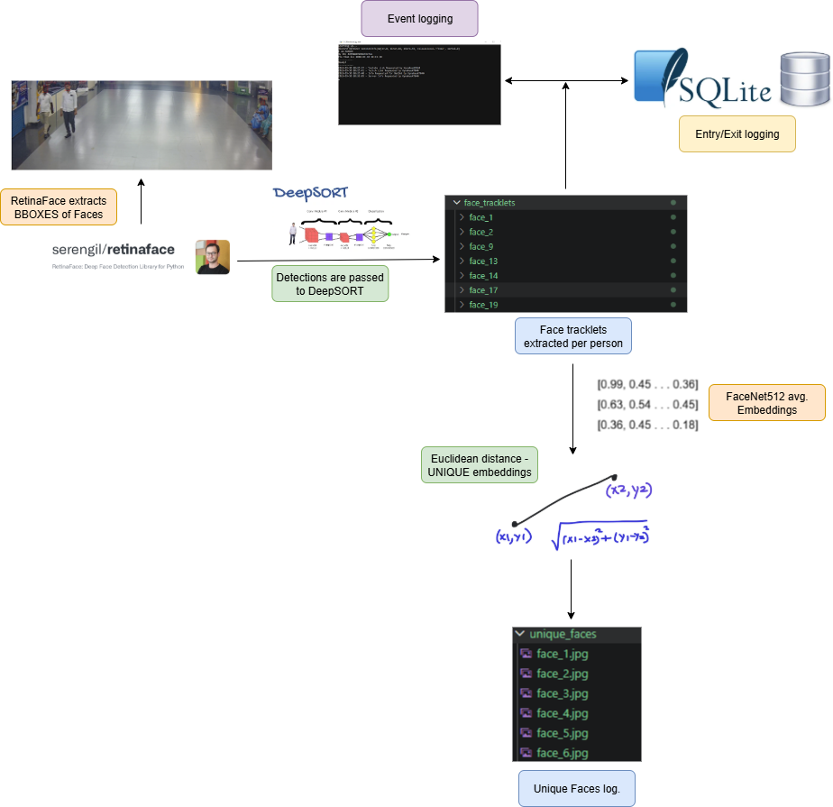

# 📸✈️ FaceLogger-RetinaNet-DeepSORT-FaceNet512-For-Airport-Unique-Visitor-Face-Logging.
This repo implements 3-stage pipeline for unique visitor face logging useful in public places like airports. RetinaFace based on the RetinaNet backbone was used for face detection while DeepSORT was used to track faces across frames and generate tracklets. Finally FaceNet512 embeddings + Euclidean distance were used for unique face log generation.

This file contains the **running environment** setup instructions and a guide which explains the **folder structure** and what code files demonstrate what feature.

# 🔧Environment setup

1. Ensure the ```uv``` package manager is installed and open the terminal. First to install PyTorch with cuda support run:
```uv pip install torch torchvision --index-url https://download.pytorch.org/whl/cu126```

2. Then to install the other libraries required to run the code: ```uv add -r requirements.txt```

# 🤔Assumptions:
1. **RetinaFace** was preferred over all YOLO variants because **RetinaNet** based backbones are better for detecting **small objects** such as faces in crowded scenes.
2. **FaceNet-512's MobileNet based backbone** was preferred over the Inception/ResNet based backbones for **edge device** constraints.

# Overview of the pipeline


# 📂 Project Structure
```bash
.
├── Architecture_diagrams/    # contains a visual representation of the multistage pipelines used for the task.
├── demo_video/               # contains video recordings of test runnings of the proposed pipelines in Task1 and Task2.
├── data/                     # FaceNet512 dependency.
├── face_tracklets/           # Landing folder for DeepSORT generated tracklets.
├── layers/                   # FaceNet512 dependency.
├── logs/entries/YYYY-MM-DD   # Python event log which gets updated upon events like face bbox generation, tracklet generation etc.
├── models/                   # FaceNet512 dependency.
├── test_videos/              # Test videos to run pipeline.
├── unique_faces              # Lists the unique face appearences inspite of multiple re-entries.
├── utils/                    # FaceNet512 dependency.
├── weights/                  # MobileNet backbone based FaceNet-512b weights file.
├── config.json               # config variable for frame skipping
├── config.yaml               # config variables for DeepSORT                                
├── requirements.txt          # Project dependencies
├── deepsort_facetracker.py   # configures deepsort for face tracking.
├── face_log_generation_utils.py  # saves face tracklets from deepSORT tracks.
├── log.db                    # entry/exit log.
├── log_gen_pipeline.ipynb    # Complete script for running full pipeline.
├── retinaface_bboxes.py      # obtains retinaface bboxes.
├── tracklet_to_log.py        # generates unique faces report
├── unique_faces_report.csv   # maintains count of unique faces.


```

---

# 🟩Please see . . .

If there is any issue running the code files and obtaining the output, you can find the recordings of the test runs of Task1 and Task2 in the ```demo_video``` folder or you can view it in ```YouTube``` by clicking on these links here:

# Demo for Task1 👇

<video src="demo.mp4" controls width="640"></video>
[[Link to Demo for Task 1]](https://youtu.be/7WcmFbG4aOE "Click to watch")

# 🏆Acknowledgement 

This project is a part of a hackathon run by https://katomaran.com. 
